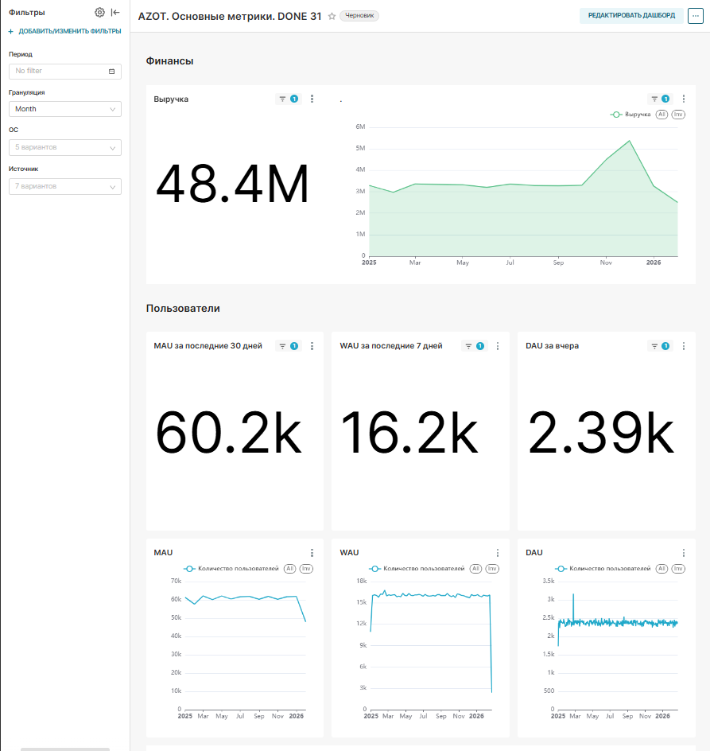
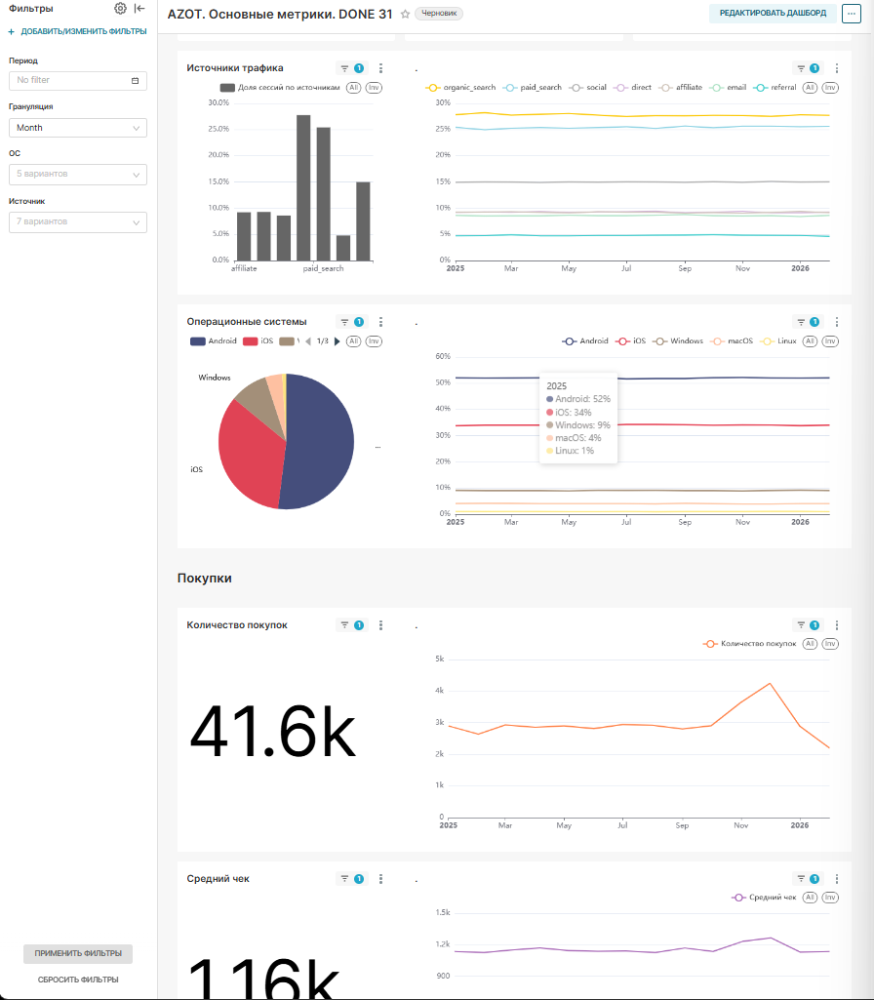
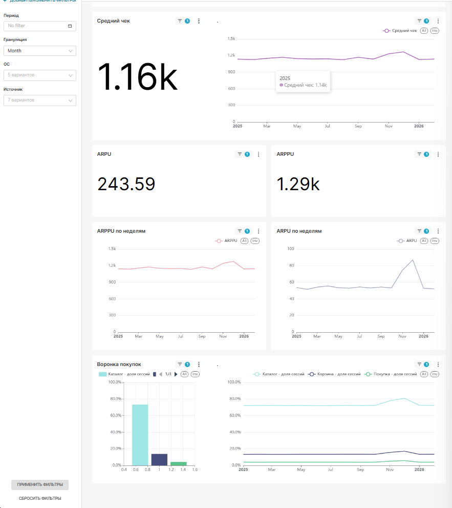

##Интерактивный дашборд для мониторинга ключевых продуктовых и финансовых показателей сервиса. Собран в Apache Superset на учебных данных

🔗 **Дашборд:** https://superset-edu.tbank.ru/superset/dashboard/p/1v3gJpVXmRr/

> Дашборд расположен в учебной среде и открывается после авторизации. Чтобы результат был виден без доступа, ниже приведены скриншоты.

## Скриншоты

### Финансы и аудитория (выручка, DAU/WAU/MAU)

### Источники трафика, ОС и покупки

### Средний чек, ARPU/ARPPU и воронка покупок

---

*Инструменты: Apache Superset, SQL. Данные учебные.*
